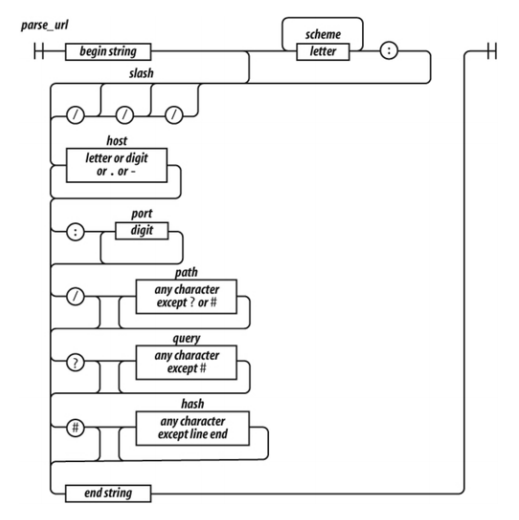
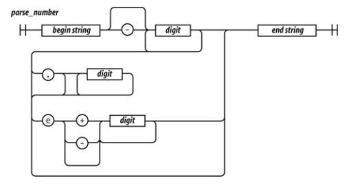

# Session 1

## Pre-conditions

- Go to https://regexr.com/

## Discussion

- ### **Chapter 7 - Regular Expressions**

  - **7.1 An example**

    Parse URL regex

    ``` Javascript

    var url_regex = /^(?:([A-Za-z]+):)?(\/{0,3})([0-9.\-A-Za-z]+)(?::(\d+))?(?:\/([^?#]*))?(?:\?([^#]*))?(?:#(.*))?$/;
    var url = 'http://www.ora.com:80/goodparts?q#fragment';
    
    parse_url.exec(url); // ['http://www.ora.com:80/goodparts?q#fragment', 'http', '//', 'www.ora.com', ...]

    ```
  
    

    **Attention! This is the worst url-matcher, ever**

    Test number regex

    ``` Javascript
      var  parse_number = /^-?\d+(?:\.\d*)?(?:e[+\-]?\d+)?$/i;
      var test = function (num) {
        console.log(parse_number.test(num));
      };

      test('1'); // true
      test('number'); // false
      test('98.6'); // true
      test('132.21.86.100'); // false
      test('123.45E-67'); // true
      test('123.45D-67'); // false
    ```
  
    

  - **7.2 Construction**

      2 ways to define a regular expression:
      
      ``` Javascript
      var parse_number = /^-?\d+(?:\.\d*)?(?:e[+\-]?\d+)?$/i; // This is the preferred way
      var parse_number_alt = new RegExp('^-?\d+(?:\.\d*)?(?:e[+\-]?\d+)?$', 'i'); // You can use this way if you need to create a dynamic regex (ex. based on a variable)
      ```

  - **7.3 Elements**
      
    - You can add an "OR" expression in a regex by using the '|' (pipe) sign to split the regex into multiple ***regexp sequences***
    - A sequence is a (repeat of) a ***regexp factor*** with an optional ***regexp quantifier***
    - A ***regexp factor*** is a single matching element of a regex. In ex. for regex /^[a-zA-Z]+[0-9]{1-3}.*[\\.\\,\\?\\!]?$/ we can find the following factors:
      - ^ 
      - [a-zA-Z]
      - [0-9]
      - . (any char)
      - [\\.\\,\\?\\!] (Punctuation mark)
      - $
    - A ***regexp quantifier*** is the optional part that comes right after the ***regexp factor***. Following the previous example, we get the following quantifiers:
      - \+ (matches 1 or more)
      - {1-3} (matches 1, 2 or 3)
      - \* (matches 0 or more)
      - ? (matches 0 or 1)

    - ***regexp escapes*** are used for defining any special character:
      - f (formfeed)
      - n (newline)
      - r (carriage return)
      - t (tab)
      - u[0-9]{4} (unicode representation of a character)

      - B (matches any char that is not a word boundary char, matches a position, not a character (like ^ and $))
      - D (matches any char that is not a digit ([^0-9]))
      - S (matches any char that is not a whitespace (spaces, tabs, line breaks))
      - W (matches any char that is not a word ([^A-Za-z0-9_]))
      - b (matches any char that is a word boundary char, matches a position, not a character (like ^ and $))
      - d (matches any char that is a digit ([^0-9]))
      - s (matches any char that is a whitespace (spaces, tabs, line breaks))
      - w (matches any char that is a word ([^A-Za-z0-9_]))

    - A ***regexp group*** is a piece of regex surrounded by (). There are 4 kinds of groups:
      - Capturing group ([0-9]px)\
        Groups multiple tokens together and creates a capture group for extracting a substring or using a backreference.
      - Noncapturing group (?:[0-9]px)\
        Groups multiple tokens together without creating a capture group.
      - Positive lookahead group [0-9](?=px)\
        Matches a group after the main expression without including it in the result.
      - Negative lookahead group [0-9](?!px)\
        Specifies a group that can not match after the main expression (if it matches, the result is discarded).